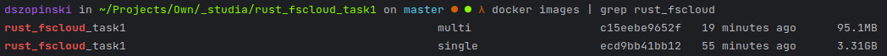

# Fs-cloud-Task1 
<i>Written with RUST</i> 🦀

## Multi-stage and Single-stage comparision


## Build & Run
* Build
```shell
docker build -t rust_fscloud_task1:single -f Dockerfile-single .
```
```shell
docker build -t rust_fscloud_task1:multi -f Dockerfile-multi .
```

* Build for specific architectures
```shell
docker buildx build -t siguard/rust_fscloud_task1:buildx -f Dockerfile-multi --load --platform linux/arm/v7,linux/arm64/v8,linux/amd64 .
```

* Run
```shell
docker run -p 8080:8080 -v ./var:/app/var --rm -it rust_fscloud_task1:single
```
```shell
docker run -p 8080:8080 -v ./var:/app/var --rm -it rust_fscloud_task1:multi
```