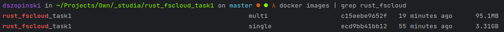

# Fs-cloud-Task1 
<i>Written with RUST</i> 🦀

## Multi-stage and Single-stage comparision


## Build & Run
* Build
```shell
docker build -t rust_fscloud_task1:single -f Dockerfile-single .
```
```shell
docker build -t rust_fscloud_task1:multi -f Dockerfile-multi .
```

* Run
```shell
docker run -p 8080:8080 -v ./var:/app/var --rm -it rust_fscloud_task1:single
```
```shell
docker run -p 8080:8080 -v ./var:/app/var --rm -it rust_fscloud_task1:multi
```