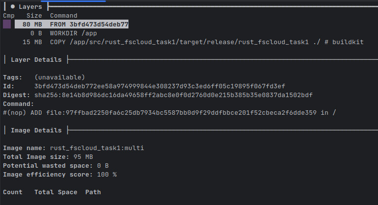

# Sprawozdanie

## 1. Część obowiązkowa

<i>
Dostępne są dwa pliki Dockerfile.
Jeden buduje obraz kontenera na jednej warstwie,
drugi buduje obraz wielowarstwowo.
</i>


### a. Budowa obrazu multi-stage
<i>W celu budowy obrazu multi-stage należy wykonać poniższe polecenie.</i>

```shell
docker build -t rust_fscloud_task1:multi -f Dockerfile-multi .
```

### b. Uruchomienie kontenera
<i>
Aby zapewnić prawidłowe działanie aplikacji należy uruchomić kontener
montując wolumin /app/var oraz udostępniając port 8080.
</i>

```shell
docker run -p 8080:8080 -v ./var:/app/var --rm -it rust_fscloud_task1:multi
```

### c. Uzyskanie informacji wygenerowanych przez kontener
<i>
Aplikacja zapisuje informacje w pliku znajdującym się w katalogu <b>/app/var/log</b>. 
Nazwą pliku jest data uruchomienia kontenera w formacie ISO 8601 z rozszerzeniem ".log"
np. 2023-05-29T14:35:37.976128098+00:00.log. 
</i>
<p><u>
Aby dostać się do danych należy otworzyć katalog <b>./var/log</b>. 
</u></p>

### d. Ilość warstw posiadanych przez obraz
