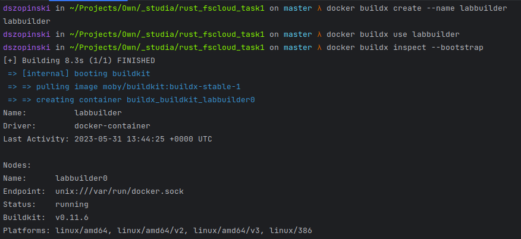

# Sprawozdanie

## 1. Część dodatkowa

<i>
W celu zbudowania obrazu wieloplatformowego proszę 
skorzystać z pliku ./Dockerfile
</i>


### a. Utworzenie i wybór buildera
<i>W celu utworenia buildera należy wykonać poniższe polecenia.</i>

```shell
docker buildx create --name labbuilder
```

```shell
docker buildx use labbuilder
```



### b. Doinstalowanie pakietu QEMU poprzez uprzywilejowany kontener
<i>W tym celu należy wykonać poniższe polecenie.</i>

```shell
docker run --rm --privileged multiarch/qemu-user-static --reset -p yes
```


### c. Budowa wieloplatformowego obrazu
<i>
Zbudowane zostaną obrazu na 3 wskazanie architektury, 
a następnie wypchnięte do repozytorium na 
dockerhub <b>siguard/rust_fscloud_task1</b> z tagiem <b>buildx</b>.
</i>

```shell
docker buildx build -t siguard/rust_fscloud_task1:buildx --push --platform linux/arm/v7,linux/arm64/v8,linux/amd64 .
```

### -- Wnioski

<i>
Podczas budowy obrazów kilkukrotnie napotkałem na 
problemy z kończącym się miejscem na dysku.
Wykorzystałem polecenia <b>docker rmi</b> oraz <b>docker buildx prune</b>.
Cache na moim służbowym laptopie zajmował około 8-10GB. 
Cache na komputerze domowym przekroczył 39GB. 
</i>

